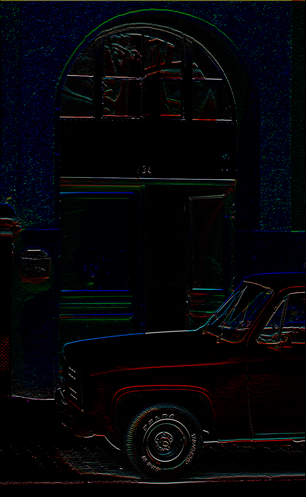

## Simple Image Proceesing in Go

This project applies a convolution kernel to an input image using Go. It reads an image, processes it with a chosen kernel (e.g., blur, edge detection), and outputs the transformed image.

#### Input vs Output (ie: sobel filter)

    
    

---

#### FAQ

- Q: Why?
- A: 🤷
